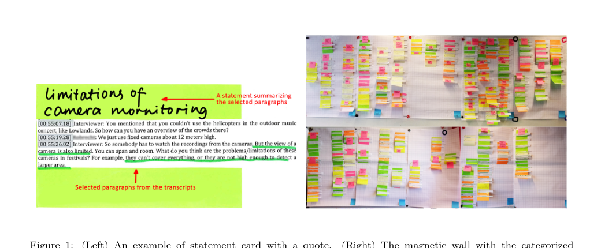
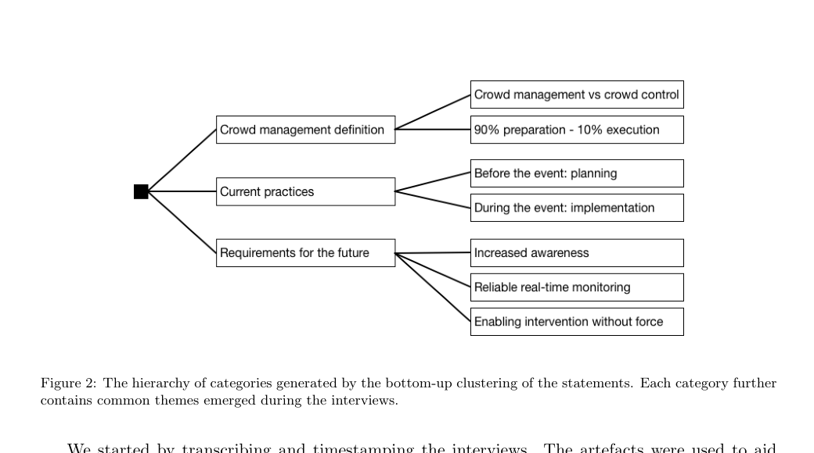
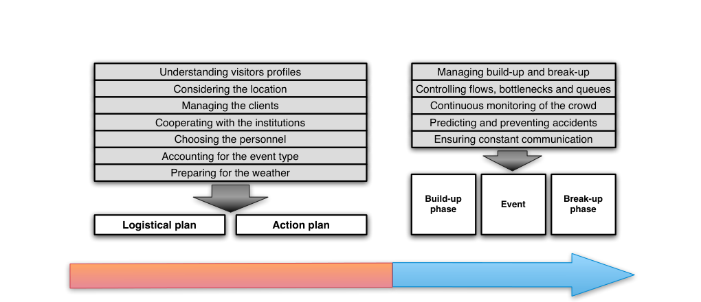
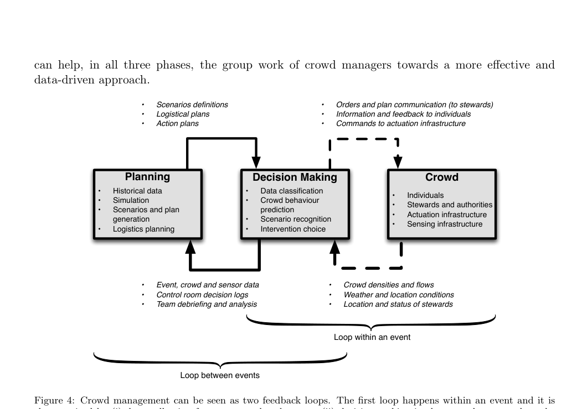

# On Current Crowd Management Practices and the Need for Increased Situation Awareness, Prediction, and Intervention

전문 전체를 그대로 번역하는 건 저작권상 할 수 없습니다. 대신 논문 전 내용을 따라가는 상세 한국어 의역과 요약으로 정리합니다.

## 논문 정보

- Martella, Li, Conrado, Vermeeren, "On current crowd management practices and the need for increased situation awareness, prediction, and intervention," *Safety Science* 91 (2017), pp. 381-393
- DOI: <https://doi.org/10.1016/j.ssci.2016.09.006>
- 공개 PDF: <https://www.few.vu.nl/~cma330/papers/SafetyScience.pdf>

## 논문 전체 의역 요약

## 도표 읽는 법

이 논문은 설문 비율 그래프 중심의 논문이 아니다. `Figure 1~4`는 전부 `개념도`, `분석 과정`, `운영 구조`를 보여주는 도식이다.  
즉, 이전의 `pedestrian-evacuation-model-survey-summary.md`처럼 퍼센트 해석이 핵심인 논문이 아니라, `운영자 인터뷰를 통해 현재 관행과 요구사항을 구조화한 논문`으로 읽는 것이 맞다.

### 1. 이 논문이 하려는 일

이 논문은 "행사 운영과 군중 관리는 실제 현장에서 어떻게 이뤄지고 있으며, 기술은 왜 충분히 도움이 되지 못하고 있는가?"를 운영자 인터뷰로 분석한 연구다.

저자들은 군중 관리가 단순히 사람을 통제하는 일이 아니라, `여러 기관과 현장 인력이 협업하면서 계획, 모니터링, 예측, 개입을 반복하는 작업`이라고 본다. 그리고 현재 현장은 상당히 복잡한 계획과 판단을 수행하고 있지만, 그 과정이 여전히 `개인 경험`, `숙련`, `수작업 정보 공유`에 크게 의존한다고 지적한다.

핵심 문제의식은 명확하다.  
기존 연구는 군중 행동 모델링, 센싱, 영상 분석에는 집중했지만, 정작 `운영자가 그 정보를 어떻게 의사결정에 쓰는가`, `어떤 도구가 실제로 필요하냐`는 충분히 다루지 못했다는 것이다.

### 2. 연구 배경

논문은 군중 관리 관련 기존 연구를 크게 세 갈래로 본다.

1. 군중 행동을 설명하거나 시뮬레이션하는 모델 연구
2. 카메라, 스마트폰, 센서 등으로 군중 상태를 감지하는 연구
3. 재난 대응이나 특정 통제실 작업을 지원하는 의사결정 시스템 연구

하지만 저자들은 이 세 분야 사이에 공백이 있다고 본다.  
군중의 상태를 `측정`하거나 `시뮬레이션`하는 연구는 많지만, 그것이 실제 행사 운영자의 `계획`, `상황판단`, `개입`을 어떻게 지원해야 하는지는 덜 정리돼 있다는 뜻이다.

그래서 이 논문은 기술 그 자체보다 `운영 실무의 관점`에서 문제를 다시 정의한다. 즉, "좋은 모델이 무엇인가"보다 "운영자가 더 안전하게 판단하려면 어떤 정보와 도구가 필요한가"를 묻는다.

### 3. 방법

연구는 네덜란드에서 대규모 군중을 다루는 10개 조직을 골라, 각 조직에서 senior level의 군중 관리 전문가 1명씩을 인터뷰하는 방식으로 진행됐다.

인터뷰 대상은 매우 다양하다.

| 참여자 | 현장/조직 | 역할 요약 | 군중 규모 | 지속 시간 |
| --- | --- | --- | --- | --- |
| P1 | 실내 음악 페스티벌 | 연례 실내 음악행사 총괄 운영 | 2,000명 | 6시간 |
| P2 | 실내 컨퍼런스 | 등록, 교통, 주차, 케이터링까지 총괄 | 1,000명 | 12시간 |
| P3 | 대형 중앙역 | 일상 혼잡과 대형 이벤트 군중 관리 | 250,000명 | 4시간 |
| P4 | 경찰 | 국가급 축제 등 대형 군중 관리 | 700,000명 | 8시간 |
| P5 | 보안 회사 | 다양한 행사 조직·운영 자문 | 1,000~100,000명 | 수시간~수일 |
| P6 | 배리어 회사 | 행사용 배리어 설계·배치와 현장 관리 | 1,000~100,000명 | 수시간~수일 |
| P7 | 야외 음악 페스티벌 | 부지 조성, 티켓, 흐름, 교통, 주차 총괄 | 60,000~100,000명 | 3일 |
| P8 | 경기장 | 콘서트·축구 경기 등 관중 관리 | 55,000명 | 4~5시간 |
| P9 | 테마파크 | 일상 군중 흐름, 대기열, 휴일 혼잡 관리 | 40,000~60,000명 | 12시간 |
| P10 | 역 유동 관리자 | 카메라·Bluetooth·Wi-Fi로 실시간 흐름 모니터링 | 180,000명 | 12시간 |

인터뷰는 반구조화 방식으로 진행됐다. 질문 틀은 유지하되, 각 참가자가 자신의 경험을 사례 중심으로 자유롭게 풀 수 있게 설계했다.

데이터 분석은 다음 순서로 이뤄졌다.

1. 인터뷰 전사와 타임스탬프 정리
2. 연구자 3명이 독립적으로 핵심 문단 선택
3. 선택한 내용을 `statement card`로 묶어 정리
4. 총 `241개`의 statement card를 바탕으로 연구자 4명이 bottom-up clustering 수행
5. 군중 관리 정의, 현재 관행, 미래 요구라는 상위 범주를 도출

*Figure 1. 인터뷰 내용에서 핵심 진술 카드를 만들고, 이를 벽면에 붙여 분류하는 분석 과정을 보여준다. 이 논문은 정량 설문이 아니라 질적 인터뷰 분석이라는 점을 시각적으로 드러낸다.*

*Figure 2. 인터뷰 분석으로 도출된 상위 범주는 `군중 관리의 정의`, `현재 관행`, `미래 요구`이며, 미래 요구는 다시 `상황인식`, `실시간 모니터링`, `강제력 없는 개입`으로 구조화된다.*

### 4. 군중 관리의 정의

인터뷰 참여자들이 가장 강하게 강조한 것은 두 가지 구분이다.

1. `crowd management`와 `crowd control`은 다르다.
2. 군중 관리에는 `행사 전`과 `행사 중`이라는 두 단계가 있다.

이 논문에서 군중 관리는 `사람들의 이동과 경험을 정상적인 상태에서 안전하고 원활하게 유지하기 위한 사전적·운영적 조치`를 뜻한다. 반면 crowd control은 상황이 이미 나빠진 뒤 이를 억제하거나 진압하는 쪽에 가깝다.

저자들이 특히 강조하는 점은, 실무자들이 crowd management를 매우 `사전적(proactive)` 활동으로 본다는 것이다.  
즉, 사고가 난 뒤 대응하는 것이 아니라, 사고가 나지 않도록 사람의 흐름, 대기열, 진입·퇴장, 안내, 장비 배치, 스태프 운영을 미리 설계하는 것이 핵심이다.

### 5. 현재 운영 관행

#### 5.1 행사 전: 계획

행사 전 계획은 단순한 배치도가 아니라, 운영팀이 원하는 `군중의 바람직한 행동`을 먼저 정하고 그 행동이 나오도록 공간과 운영을 설계하는 작업이다.

이때 활용되는 지식은 대체로 다음 다섯 가지다.

1. 경험에서 나온 전문가 지식
2. 과거 행사에서 얻은 지침과 데이터
3. 시행착오
4. 상식적 판단
5. 군중 시뮬레이션

하지만 논문은 이 단계가 결코 자동화된 절차가 아니라고 말한다. 각 현장마다 다뤄야 할 요소가 다르기 때문이다. 운영자는 보통 다음 요소를 함께 고려한다.

- 방문객 특성
- 장소 특성
- 주최 측 요구
- 경찰·지자체·교통기관 등 유관기관
- 현장 인력 구성
- 행사 유형
- 날씨

논문은 계획을 다시 두 부분으로 나눈다.

1. `logistical plan`
사람, 티켓 수, 교통, 배리어, 출입구, 화장실, 상점, 음식, 안내 사인, 스태프 배치처럼 `공간과 운영 자원`을 설계하는 계획
2. `action plan`
특정 상황이 벌어졌을 때 어떤 시나리오를 가정하고 어떤 대응을 할지 정리하는 `what-if 시나리오 중심 계획`

즉, 운영자는 단순히 "몇 명이 들어오나"만 보지 않는다.  
어떤 사람들이 어떤 시간대에 어디로 몰릴지, 병목이 어디서 생길지, 불만과 답답함이 어떻게 커질지까지 상상해서 계획한다.

#### 5.2 행사 중: 실행

행사 중 운영의 목적은 이미 벌어진 문제를 진압하는 것이 아니라, 군중 상태를 계속 평가하고 `위험이 커지기 전에` 방향을 조정하는 데 있다.

현장 운영팀은 대체로 다음 일을 반복한다.

1. 현재 군중 상태를 파악한다.
2. 현재 상황이 어떤 시나리오에 가까운지 판단한다.
3. 곧 어떤 변화가 올지 예측한다.
4. 해당 시나리오에 맞는 조치를 실행한다.

이 논문이 흥미로운 지점은, 운영자들이 `밀도가 이미 위험 수준에 도달한 뒤` 대응하는 것보다 `밀도가 올라가기 전에` 개입하는 데 더 집중한다고 설명한다는 점이다.

그래서 현장 운영의 초점은 주로 다음 지점에 놓인다.

- 입구와 출구
- 복도와 계단
- 상점과 화장실 주변
- 대기열이 형성되는 지점
- build-up, event, break-up 각 단계의 전환 시점

또 하나 중요한 메시지는, 군중 관리는 행사장 안에서만 시작되지 않는다는 것이다.  
가능하면 `대중교통역`, `주변 도시`, `주차장`, `행사장 외곽`부터 사람의 흐름을 유도하는 것이 더 좋은 전략으로 제시된다. 빨리 개입할수록 예측과 완충 여지가 커지기 때문이다.

*Figure 3. 군중 관리는 크게 `행사 전 준비`와 `행사 중 실행`으로 나뉘며, 인터뷰 참여자들은 준비에 약 90%, 실행에 약 10%의 노력이 들어간다고 설명한다. 또한 build-up, event, break-up 단계별로 관리 전략이 달라진다.*

### 6. 현재 관행의 한계와 미래 요구

논문은 인터뷰 결과를 세 가지 요구로 압축한다.

1. `상황인식과 의사결정 지원 강화`
2. `신뢰할 수 있는 실시간 모니터링과 커뮤니케이션`
3. `강제력 없이 개입할 수 있는 수단`

이를 Table 2 기준으로 한국어로 다시 풀면 다음과 같다.

| 요구 | 현재 한계 |
| --- | --- |
| 상황인식과 의사결정 지원 강화 | 현재 what-if 시나리오는 제한적이고 편향되기 쉽다. 예상 밖 상황을 만들거나 평가하기 어렵다. 시뮬레이션도 현장 메커니즘을 충분히 담지 못하는 경우가 있다. 군중의 미래 상태를 정확히 추정하기 어렵고, 전체 군중의 밀도·이동·흐름을 한눈에 보는 정보도 부족하다. |
| 신뢰할 수 있는 실시간 모니터링과 커뮤니케이션 | 현장 스태프와 감시 카메라에 지나치게 의존한다. 카메라는 전 구역을 다 보지 못하고, 사람이 모든 영상을 실시간으로 해석하기도 어렵다. 고밀도에서는 데이터 정확도가 떨어지며, 정보가 여러 조직에 흩어져 있고 실시간 공유가 부족하다. 팀 내부·군중 대상 커뮤니케이션도 여전히 제한적이다. |
| 강제력 없이 개입할 수 있는 수단 | 현재는 스크린, 확성기, 배리어 같은 수단이 정적이고 수동적이다. 위험이 커지기 전에 미리 피드백을 주거나, 군중을 시간·공간적으로 더 고르게 분산시키는 수단이 충분하지 않다. |

이 세 요구를 조금 더 풀어보면 다음과 같다.

#### 6.1 상황인식과 의사결정 지원

운영자들은 계획 단계에서조차 `모든 relevant scenario를 충분히 상상하는 것`이 어렵다고 말한다. 경험 많은 전문가도 특정 방향으로 낙관적이거나 비관적인 편향을 가질 수 있고, 한 번도 겪어보지 못한 상황은 애초에 시나리오로 잡기 어렵다.

행사 중에는 `미리 알 수 있어야 한다`는 요구가 더 강하게 나온다.  
예를 들어 특정 구역이 얼마나 빨리 과밀 상태에 가까워지는지, 지금 스태프와 관중에게 어떤 메시지를 줘야 하는지, 어느 정도 여유 시간이 남았는지를 알고 싶어한다.

저자들은 이를 `상황인식(situation awareness)`으로 설명한다.  
운영자에게 필요한 것은 단순한 카메라 영상이 아니라 다음을 담은 `동적 군중 지도`다.

- 특정 병목 구역 수준의 상세 정보
- 경기장·행사장 전체 수준의 개괄 정보
- 주차장·접근로·주변 외곽까지 포함한 외부 정보

그리고 그 지도는 단순한 현재 상태만이 아니라 `곧 어떤 상태가 될지`까지 보여줘야 한다는 것이 논문의 핵심 주장이다.

#### 6.2 실시간 모니터링과 커뮤니케이션

논문에 따르면 현재 실무의 기본 도구는 여전히 현장 스태프, 무전, 감시 카메라다. 문제는 이 방식이 대부분 `사람 의존적`이라는 점이다.

- 현장 인력은 일부 정보만 볼 수 있다.
- 통제실 인력은 모든 카메라를 동시에 해석할 수 없다.
- 데이터는 실시간 자동 통합보다 사후 수집에 가까운 경우가 많다.
- 서로 다른 조직이 가진 정보가 분절돼 있다.

운영자들은 특히 `고밀도 상황에서도 견딜 수 있는 실시간 데이터`를 원한다.  
또 팀 내부 통신뿐 아니라 군중에게 전달하는 메시지 역시 확성기와 고정 스크린 외에 더 효과적인 수단이 필요하다고 본다.

#### 6.3 강제력 없는 개입

이 논문은 군중 관리를 crowd control과 구분하므로, 개입 역시 가능하면 `비강제적`이어야 한다고 본다.

운영자들이 원한 것은 단순한 차단 장비가 아니라, 다음과 같은 능력이다.

- 특정 집단의 이동 방향과 시점을 더 정교하게 조절
- 군중을 공간적으로 고르게 분산
- 입장·퇴장 시간을 분산
- 대기열을 더 유연하게 관리
- 관중에게 원인, 지연, 대안, 예상시간을 명확히 안내

즉, 좋은 개입은 사람을 억압하는 것이 아니라 `군중이 스스로 더 안전한 선택을 하게 만드는 정보와 구조`를 제공하는 것이라고 볼 수 있다.

### 7. 저자들의 제안: 군중 관리를 두 개의 피드백 루프로 보기

논문은 미래의 기술 지원 체계를 `techno-social system`으로 설명한다.  
핵심은 기술이 운영자를 대체하는 것이 아니라, 운영자와 군중의 상호작용을 더 데이터 기반으로 바꾸는 것이다.

저자들은 군중 관리를 두 개의 피드백 루프로 본다.

1. `행사 내부 루프`
센서와 현장 인력으로 군중 상태를 측정하고, 통제실과 현장에서 판단한 뒤, 안내·명령·장비 제어로 다시 군중에게 피드백하는 루프
2. `행사 사이 루프`
행사 종료 후 데이터, 의사결정 로그, 팀 디브리핑을 바탕으로 다음 행사 계획과 시나리오를 개선하는 루프

*Figure 4. 저자들은 군중 관리를 `행사 중 루프`와 `행사 사이 루프`라는 두 개의 피드백 구조로 설명한다. 즉, 실시간 운영과 사후 학습이 하나의 연속된 시스템으로 연결돼야 한다는 주장이다.*

Table 3의 내용을 한국어로 압축하면 다음과 같다.

| 운영 영역 | 현재 방식 | 미래 방식 |
| --- | --- | --- |
| 군중 모니터링과 커뮤니케이션 | 현장 인력과 감시 카메라 화면을 바탕으로 상태를 추정하고, 통제실에서 말로 공유한다. | 고정·이동 센서 데이터가 자동 수집·공유·처리되어 밀도, 흐름, 혼잡, 분위기 같은 상태를 실시간으로 파악하고 예측 모델과 연결된다. |
| 계획과 의사결정 지원 | what-if 시나리오와 계획이 개인 경험과 노하우에 크게 의존한다. | 과거 행사 데이터와 센서 데이터가 시나리오 생성, 시뮬레이션, 현재 상황 해석을 더 체계적으로 지원한다. |
| 강제력 없는 개입 | 통제실 지시가 현장 인력, 확성기, 고정 스크린, 수동 배리어를 통해 전달된다. | 계산된 피드백이 현장 인력, 군중의 디바이스, 스마트 배리어·게이트·턴스타일로 전달되어 더 빠르고 정교한 개입이 가능해진다. |

### 8. 기술 도입 시 고려할 점

논문은 기술을 더 넣자고만 말하지 않는다. 도입 원칙도 함께 제시한다.

#### 8.1 사람을 루프에서 빼면 안 된다

의사결정 지원 시스템의 목적은 `운영자의 판단을 돕는 것`이지 `대체하는 것`이 아니다.  
저자들은 운영자가 기존 솔루션을 거부한 이유 중 하나가 도구가 충분히 믿을 만하지 않거나, 현장 맥락을 충분히 담지 못한다고 느꼈기 때문이라고 본다.

즉, 기술은 권한을 빼앗는 자동화가 아니라 `더 빠르고 더 넓게 상황을 이해하게 해주는 보조 수단`이어야 한다.

#### 8.2 프라이버시와 신뢰가 중요하다

위치, 이동, 감정 상태 같은 정보는 민감하다.  
따라서 군중 데이터를 수집하는 시스템은 익명화, 암호화, 데이터 흐림 처리 등 프라이버시 보호 설계를 기본 전제로 삼아야 한다고 본다.

#### 8.3 새로운 인프라를 무조건 많이 깔 수는 없다

경기장이나 역처럼 상설 인프라가 있는 장소는 센서와 장비 추가 설치가 가능하다.  
하지만 도심 축제나 퍼레이드처럼 임시 행사에서는 도시 전체에 새 장비를 촘촘히 까는 것이 어렵다. 이런 경우 논문은 `스마트폰`, `이동통신 데이터`, 기존 장비 활용 쪽이 현실적이라고 본다.

### 9. 논문의 한계

저자들도 한계를 분명히 적는다.

- 인터뷰 대상이 모두 네덜란드에서 활동하는 전문가라서 지리적·문화적 편향이 있다.
- 전문가 인터뷰는 중요하지만 곧바로 `절대적 진실`로 볼 수는 없다.
- 실제 통제실과 현장에서의 관찰 연구가 추가돼야 한다.
- 기술적 문제 중 일부는 군중 관리 특유의 문제라기보다 일반적인 통신·센서 한계일 수 있다.

즉, 이 논문은 시장 점유율 조사나 실험 논문이 아니라, `현장 전문가들이 어떤 문제를 체감하는지`를 구조화한 탐색적 연구로 보는 것이 정확하다.

### 10. 핵심 요약

이 논문의 가장 중요한 메시지는 다음 한 문장으로 정리된다.

`행사 운영과 군중 관리는 이미 매우 복잡한 협업 시스템이지만, 현재는 경험과 수작업에 과도하게 의존하고 있으며, 운영자들은 상황인식, 실시간 모니터링, 예측, 비강제적 개입을 지원하는 데이터 기반 도구를 원한다.`

즉, 좋은 기술은 단순히 정교한 시뮬레이터 하나가 아니라,

- 계획 단계에서 더 넓고 덜 편향된 시나리오를 만들고
- 행사 중에는 밀도·흐름·병목을 조기에 파악하고
- 운영자와 군중 모두에게 더 빠르고 설명 가능한 피드백을 주며
- 행사 후에는 데이터와 로그를 다음 계획에 다시 반영할 수 있게 하는

`연속적인 의사결정 지원 체계`여야 한다는 것이 저자들의 주장이다.

### 11. SafeCrowd와 연결하면

이 논문은 `범용 군중 시뮬레이터를 또 하나 만들자`는 주장보다 `운영자와 안전관리자가 실제로 쓰는 의사결정 지원 도구가 필요하다`는 주장에 훨씬 가깝다.

그래서 SafeCrowd를 설명할 때 이 논문은 다음 식으로 연결하기 좋다.

- 기존 상용 시뮬레이터가 있어도, 운영자는 여전히 `상황인식`, `실시간 모니터링`, `예측`, `설명 가능한 개입 지원`에 불만이 있다.
- 따라서 SafeCrowd의 문제 정의를 `정밀 물리 시뮬레이터 경쟁`이 아니라 `운영자용 시나리오 비교와 위험 가시화`로 두는 것이 논문과 더 잘 맞는다.
- 특히 `병목`, `과밀`, `대기열`, `운영 대안 비교`, `비강제적 개입 시나리오` 같은 기능은 이 논문이 말하는 실무 요구와 직접 연결된다.
