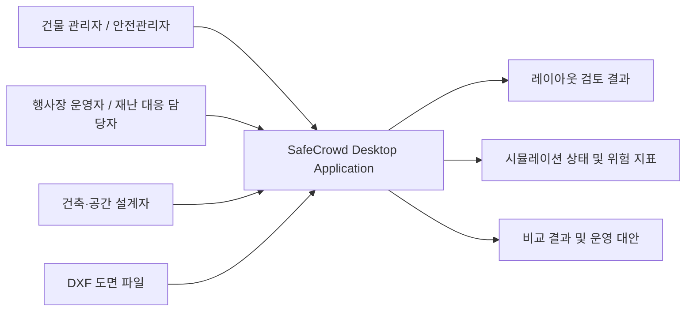
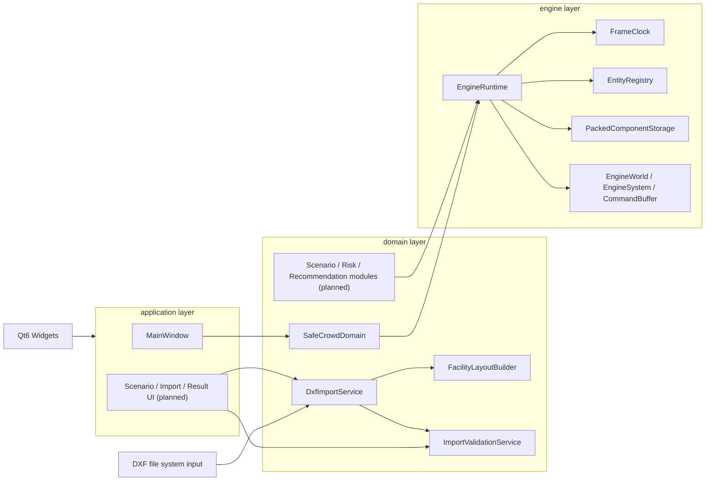
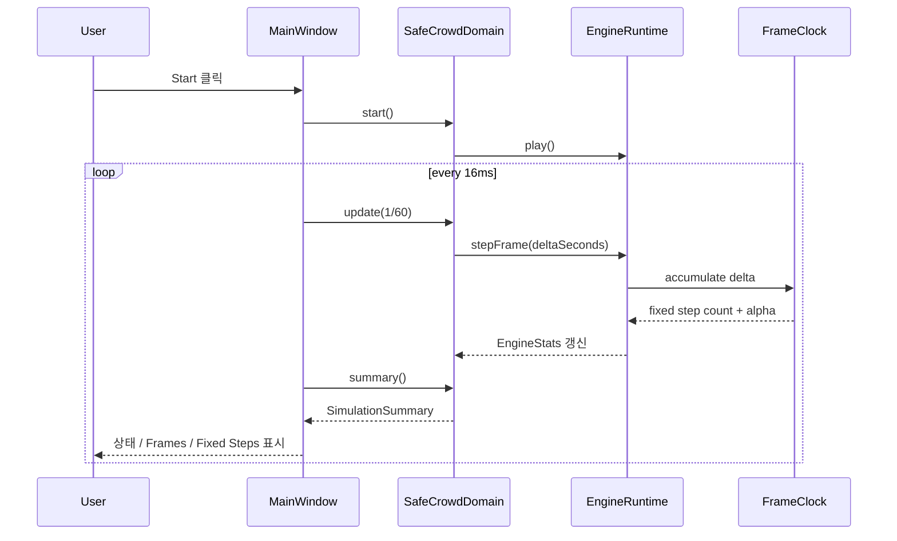
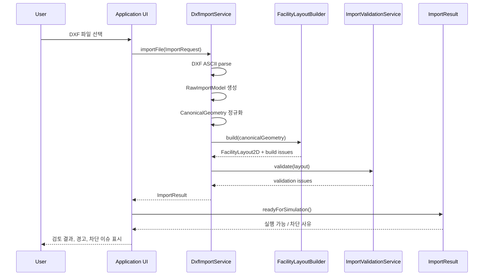
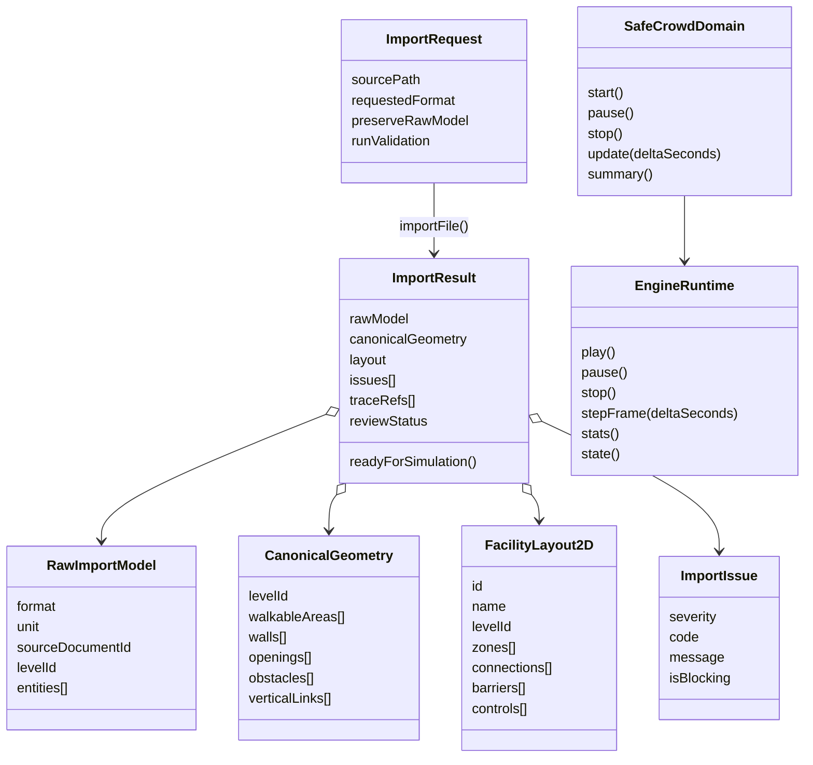

# Project Document

# System Architecture Design & Development Environment

## Project Name

**SafeCrowd: 군중 안전 시뮬레이터**

02조  
202002520 은민수  
202102629 김준용  
202202546 금소현  
202302543 김학찬  
지도교수: 고영준 교수님

## Document Revision History

| Rev# | Date | Affected Section | Author |
| --- | --- | --- | --- |
| 1 | 2026/04/06 | 초안 작성 및 Markdown 변환 | 02조 공동 |

## 0. Meta Information

| Item | Value |
| --- | --- |
| Project | SafeCrowd |
| Team | 02조 |
| Version | v1.0 |
| Framework | C++20, Qt6 Widgets, CMake, vcpkg, ECS runtime |
| Scope | Sprint 1 MVP(US-01~US-03, US-07~US-11) 중심 구조와 Sprint 2~3 확장 가능 아키텍처 |

## 1. Project Overview

### Vision

SafeCrowd는 건물 관리자, 행사장 운영자, 안전관리자, 건축·공간 설계자, 재난 대응 담당자가 실제 공간 구조를 반영한 군중 시뮬레이션을 직접 다룰 수 있게 하는 데스크톱 시스템이다.  
이 시스템은 실제 훈련을 반복하기 어려운 상황에서 병목, 정체, 압력 집중, 낙상, 탈출 지연 같은 위험을 사전에 식별하도록 돕는다.  
사용자는 DXF 기반 공간 구조를 불러오고, 운영 조건을 바꾼 여러 시나리오를 비교하면서 더 안전한 대안을 찾을 수 있다.  
SafeCrowd는 전문가 전용 범용 시뮬레이터가 아니라, 비전문가도 이해할 수 있는 UI와 설명 가능한 위험 지표를 갖춘 의사결정 지원 도구를 목표로 한다.

### Scope

#### In Scope

- DXF 도면으로부터 보행 가능 영역, 벽, 출구, 장애물을 추출하는 시설 레이아웃 import 파이프라인
- 임포트 결과를 `RawImportModel -> CanonicalGeometry -> FacilityLayout2D`로 정규화하는 도메인 모델
- 출구 누락, 연결 단절, 최소 폭 미달을 검증하는 구조 검토 및 실행 가능 상태 판정
- `application -> domain -> engine` 계층을 따르는 Qt 기반 데스크톱 애플리케이션
- 고정 timestep 기반 ECS runtime과 시작, 일시정지, 정지, 상태 요약을 포함한 실행 제어
- Sprint 2~3에서 결과 비교, 위험 분석, 추천 기능으로 확장 가능한 구조 설계

#### Out of Scope

- 웹 서비스, 모바일 앱, 멀티유저 협업 기능
- 결제, 사용자 계정, 권한 관리 같은 운영 지원 시스템
- 실시간 IoT 센서 연동이나 외부 관제 시스템과의 온라인 통합
- 서버 중심 REST API 아키텍처
- 초기 버전에서의 3D 렌더링과 물리 기반 시각 효과

### Success Metrics

- 하나의 공간 도면으로 기준안 1개와 대안 2개 이상을 구성하고 비교할 수 있다.
- 대표 시나리오에서 1,000명 규모의 군중 시뮬레이션을 안정적으로 실행할 수 있다.
- 총 대피 시간, 90%·95% 대피 시간, 최대 밀도, 압박 위험, 낙상, 미대피 인원 등 핵심 안전 지표 6종 이상을 자동 산출한다.
- 위험 히트맵으로 시나리오별 위험 구역과 변화 정도를 직관적으로 비교할 수 있다.
- 분석 결과를 바탕으로 운영 대안 3개 이상을 근거와 함께 제안할 수 있다.

## 2. Architecture Design

### System Context Diagram



시스템의 1차 입력은 사용자의 공간 도면과 시나리오 조건이며, 1차 출력은 레이아웃 검토 결과, 시뮬레이션 상태, 위험 지표와 비교 결과이다. 초기 버전은 외부 온라인 API보다 동일 프로세스 내부의 계층 분리를 우선하며, 데스크톱 애플리케이션 하나 안에서 입력, 분석, 시각화를 모두 수행한다.

### Logical Architecture



### Layer Responsibilities

| Layer | 주요 요소 | 책임 | 금지/제한 |
| --- | --- | --- | --- |
| `application` | `MainWindow`, Qt signal/slot, 향후 import/scenario/result UI | 사용자 입력 수집, 도메인 서비스 호출, 상태 표시 | ECS 내부 로직과 위험 계산식을 직접 가지지 않음 |
| `domain` | `SafeCrowdDomain`, `DxfImportService`, `FacilityLayoutBuilder`, `ImportValidationService`, 향후 시나리오/위험/추천 모듈 | SafeCrowd 문제 영역 규칙, 공간 구조 정규화, 실행 가능성 검토, 위험 지표 정의 | Qt UI 의존 금지 |
| `engine` | `EngineRuntime`, `EngineWorld`, `FrameClock`, `EntityRegistry`, `ComponentRegistry`, `PackedComponentStorage`, `WorldQuery`(`EngineWorld::query()` 경유), `CommandBuffer` | 범용 ECS runtime, fixed timestep, world 상태 관리, 시스템 실행 기반 제공 | SafeCrowd 도메인 지식 의존 금지 |

핵심 의존 방향은 아래 한 줄로 요약된다.

`application -> domain -> engine`

### Core Flow 1: 시뮬레이션 시작 및 프레임 업데이트



현재 Qt 애플리케이션은 `Start`, `Pause`, `Stop` 버튼과 `QTimer`를 사용해 실행 루프를 구동한다. `SafeCrowdDomain`은 application과 engine 사이의 얇은 파사드 역할을 수행하며, `EngineRuntime`은 프레임 누적과 상태 관리의 실제 책임을 가진다.

### Core Flow 2: DXF 도면 import 및 실행 가능 레이아웃 생성



이 흐름은 Sprint 1의 핵심 가치인 `도면 불러오기 -> 구조 검토 -> 실행 가능 여부 판단`을 담당한다. `DxfImportService`는 파일 포맷 처리와 정규화를 담당하고, `FacilityLayoutBuilder`는 시뮬레이션 입력에 가까운 레이아웃 객체를 만들며, `ImportValidationService`는 출구 연결성과 최소 조건을 검증한다. 현재 저장소에는 domain 중심의 import 파이프라인이 구현되어 있고, application의 전용 import 화면 연결은 후속 작업으로 남아 있다.

## 3. 데이터 설계 and/or API 설계

본 프로젝트는 데이터베이스 중심 CRUD 시스템이 아니라 데스크톱 시뮬레이션 시스템이므로, 전통적인 ERD 대신 도메인 데이터 모델과 내부 인터페이스를 설계 기준으로 사용한다.

### Data Model Diagram



### Integrity / Consistency Rules

- `FacilityLayout2D`에는 최소 1개의 `Exit` zone이 있어야 한다.
- 모든 non-exit zone은 적어도 1개의 exit zone으로 연결되는 경로를 가져야 한다.
- `Connection2D.effectiveWidth`가 데모 최소 폭 0.9m보다 작으면 경고를 발생시킨다.
- blocking import issue가 존재하면 시뮬레이션은 시작할 수 없다.
- `ImportResult.reviewStatus`는 `Approved` 또는 `NotRequired`이어야 실행 가능 상태가 된다.
- `engine` 레이어는 SafeCrowd 고유 타입을 모르고, `domain`은 Qt 타입을 모른다.

### Internal Interface Catalog

초기 버전은 외부 REST API를 주 인터페이스로 사용하지 않는다. 대신 동일 프로세스 내부에서 계층 간 계약을 명확히 하는 방식으로 설계한다.

| Interface | Input | Output | Purpose |
| --- | --- | --- | --- |
| `DxfImportService::importFile` | `ImportRequest` | `ImportResult` | DXF 파일을 읽어 raw/canonical/layout 단계 결과와 이슈를 함께 반환 |
| `FacilityLayoutBuilder::build` | `CanonicalGeometry` | `FacilityLayoutBuildResult` | 추상 기하 정보를 시뮬레이션 친화적 레이아웃으로 변환 |
| `ImportValidationService::validate` | `FacilityLayout2D` | `std::vector<ImportIssue>` | 출구 누락, 단절 구역, 최소 폭 미달 검증 |
| `ImportResult::readyForSimulation` | 내부 상태 | `bool` | 검토 승인과 차단 이슈를 종합해 실행 가능 여부 판정 |
| `SafeCrowdDomain::start/pause/stop/update/summary` | 사용자 명령, `deltaSeconds` | `SimulationSummary` | application에서 engine 실행을 제어하는 도메인 파사드 |
| `EngineRuntime::play/pause/stop/stepFrame` | 실행 명령, 프레임 시간 | `EngineStats`, `EngineState` | 고정 timestep 기반 runtime 상태와 진행 통계 관리 |

## 4. Development Environment

### Environment Summary

| Item | Value |
| --- | --- |
| OS | Windows x64 개발 환경 |
| Language | C++20 |
| Generator / Compiler | Visual Studio 17 2022 / MSVC |
| Build System | CMake 3.25+ |
| Package Manager | vcpkg |
| UI Library | Qt6 Widgets (`qtbase`, `widgets` feature) |
| Test | CTest + `safecrowd_tests` |
| Source Root | `src/application`, `src/domain`, `src/engine` |
| Main Targets | `ecs_engine`, `safecrowd_domain`, `safecrowd_app` |

### Build / Test Commands

```powershell
cmake --preset windows-debug
cmake --build --preset build-debug
ctest --preset test-debug
```

Qt 앱 없이 engine/domain/test만 빠르게 확인할 때는 아래 경로를 사용한다.

```powershell
cmake --preset windows-debug-no-app
cmake --build --preset build-no-app-debug
ctest --preset test-no-app-debug
```

### Preset / Dependency Notes

- `CMakePresets.json`은 `windows-debug`, `windows-debug-no-app`, `windows-release`, `windows-release-no-app` 구성을 제공한다.
- Qt를 포함하는 preset은 `VCPKG_ROOT`가 설정된 환경에서 `CMAKE_TOOLCHAIN_FILE=$env{VCPKG_ROOT}/scripts/buildsystems/vcpkg.cmake`를 사용한다.
- `vcpkg.json`은 `qtbase`의 default feature를 끄고 `widgets` feature만 활성화한다.
- import stack은 `cmake/SafeCrowdImportStack.cmake`를 통해 domain 계층에서만 연결되며, 기본 경로는 CI와 로컬 최소 환경을 위해 보수적으로 유지한다.

### Repository Structure

```text
Project/
  CMakeLists.txt
  CMakePresets.json
  vcpkg.json
  src/
    application/
    domain/
    engine/
  tests/
  docs/
  uml/
  external/
```

### Development Conventions

- include root는 `src/`이며, `#include "application/..."`, `#include "domain/..."`, `#include "engine/..."` 형식을 사용한다.
- `engine`은 `domain`이나 `application`을 참조하지 않는다.
- `domain`은 Qt UI 코드를 참조하지 않는다.
- CI는 빠른 피드백을 위해 우선 `SAFECROWD_BUILD_APP=OFF` 경로를 검증하고, 로컬에서는 전체 Qt 앱 빌드도 유지한다.

## 5. Traceability

### Requirement to Design Element Summary

| Requirement | Design Element | Notes |
| --- | --- | --- |
| US-01 도면 불러오기 | `DxfImportService`, `RawImportModel`, `CanonicalGeometry`, `FacilityLayoutBuilder` | DXF 파일을 시뮬레이션 입력 구조로 변환하는 Sprint 1 핵심 흐름 |
| US-02 구조 검토 및 경고 확인 | `ImportValidationService`, `ImportIssue`, `ImportTraceRef`, `ImportResult.reviewStatus` | 차단 이슈와 추적 정보를 함께 제공해 검토 가능 상태 구성 |
| US-03 수동 보정 후 실행 가능 상태 확정 | `FacilityLayout2D`, `Connection2D`, `ControlPoint2D`, `ImportResult::readyForSimulation()` | 레이아웃 수정과 승인 결과를 반영해 실행 가능 여부 판정 |
| US-07 인원 배치 기반 실행 제어 | `MainWindow`, `SafeCrowdDomain`, `EngineRuntime::play/pause/stop/stepFrame` | Start/Pause/Stop 중심의 application-domain-engine 연결 |
| US-09 실시간 진행 상태 확인 | `SimulationSummary`, `EngineStats`, `MainWindow::refreshStatusLabel` | 상태, frame index, fixed step index, alpha 표시 |
| US-10 병목·정체 탐지 | `FacilityLayout2D.connections/zones`, 향후 `LocalDensityField`, `FlowMeasurementSystem`, `CongestionStateSystem` | 현재 레이아웃 기반 입력을 마련했고, 위험 탐지 로직의 상세 확장은 `docs/product/고급 위험 모델.md`를 기준으로 설계 |
| US-11 압력 집중 위험 탐지 | 향후 `CompressionForce`, `CompressionExposure`, `CompressionLoadSystem`, `AsphyxiationRiskSystem` | 압박 위험 모델은 도메인 확장 설계 항목으로 정의됨 |
| US-15~US-17 결과 시각화 및 비교 | 향후 Result UI, 히트맵 레이어, 비교 요약 뷰 | 현재 계층 구조는 Sprint 2 비교/시각화 기능을 application layer에 추가할 수 있게 설계됨 |
| US-18~US-19 운영 대안 추천 | 향후 Recommendation module, scenario diff, rationale model | 현재 문서 구조와 위험 지표 정의를 기반으로 Sprint 3에서 연결 예정 |

### Traceability Note

현재 저장소에는 Sprint 1 중심의 import, 실행 제어, 상태 요약 구조가 구현되어 있으며, Sprint 2~3 기능은 백로그와 위험 정의 문서를 근거로 확장 설계가 정리되어 있다. 따라서 본 문서는 현재 구현 구조를 기준으로 하되, 이후 결과 비교와 운영 대안 추천까지 수용할 수 있는 계층 및 데이터 모델을 함께 제시한다.
